# 📋 PRD - API Client MVP

**Product Requirements Document**  
**Version:** 1.0  
**Date:** Janeiro 2026  
**Status:** Draft  
**Product Name:** Insomnia MVP Clone

---

## 📑 Índice

1. [Visão Geral](#1-visão-geral)
2. [Objetivos do Produto](#2-objetivos-do-produto)
3. [Personas e User Stories](#3-personas-e-user-stories)
4. [Requisitos Funcionais](#4-requisitos-funcionais)
5. [Requisitos Não-Funcionais](#5-requisitos-não-funcionais)
6. [Especificações Técnicas](#6-especificações-técnicas)
7. [Diagramas de Arquitetura](#7-diagramas-de-arquitetura)
8. [User Flows](#8-user-flows)
9. [Modelo de Dados](#9-modelo-de-dados)
10. [Roadmap e Milestones](#10-roadmap-e-milestones)
11. [Critérios de Sucesso](#11-critérios-de-sucesso)
12. [Riscos e Mitigações](#12-riscos-e-mitigações)
13. [Glossário](#13-glossário)

---

## 1. Visão Geral

### 1.1 Problema

Desenvolvedores precisam testar APIs REST durante o desenvolvimento, mas ferramentas existentes são: 
- Caras (Postman pago)
- Online-only (requerem internet)
- Complexas demais para uso básico
- Não open-source

### 1.2 Solução

Um **cliente de API desktop multiplataforma, open-source e gratuito** que permite: 
- Criar e organizar requisições HTTP
- Enviar requisições e visualizar respostas
- Gerenciar ambientes (dev, staging, production)
- Armazenar histórico local
- Interface intuitiva e rápida

### 1.3 Escopo do MVP

**IN SCOPE (MVP):**
- ✅ Requisições HTTP (GET, POST, PUT, DELETE, PATCH)
- ✅ Headers e Body customizáveis
- ✅ Autenticação (Basic, Bearer Token)
- ✅ Gerenciamento de Environments
- ✅ Histórico de responses
- ✅ Organização em Workspaces e Folders
- ✅ Template de variáveis simples
- ✅ Exportar/Importar collections

**OUT OF SCOPE (Pós-MVP):**
- ❌ WebSocket
- ❌ GraphQL
- ❌ gRPC
- ❌ OAuth 2.0 completo
- ❌ Pre/Post scripts
- ❌ Testing suite
- ❌ Mock servers
- ❌ Git sync
- ❌ Cloud sync
- ❌ Sistema de plugins

### 1.4 Público-Alvo

**Primary:** Desenvolvedores Backend/FullStack  
**Secondary:** QA Engineers, DevOps Engineers  
**Plataformas:** Windows, macOS, Linux

---

## 2. Objetivos do Produto

### 2.1 Objetivos de Negócio

| Objetivo | Métrica | Target (3 meses) |
|----------|---------|------------------|
| Adoção | Downloads | 1,000+ |
| Engajamento | MAU (Monthly Active Users) | 500+ |
| Qualidade | GitHub Stars | 100+ |
| Comunidade | Issues/PRs | 20+ |

### 2.2 Objetivos de Usuário

1. **Produtividade:** Reduzir tempo de teste de APIs em 50%
2. **Simplicidade:** Onboarding em < 5 minutos
3. **Confiabilidade:** 99% de taxa de sucesso em requests
4. **Performance:** Response time < 100ms para UI actions

---

## 3. Personas e User Stories

### 3.1 Personas

#### Persona 1: Alex - Backend Developer
- **Idade:** 28 anos
- **Experiência:** 4 anos
- **Tech Stack:** Node.js, Python
- **Pain Points:** 
  - Postman é caro para uso pessoal
  - Precisa testar APIs localmente sem internet
  - Quer algo rápido e simples
- **Goals:**
  - Testar endpoints rapidamente
  - Organizar requests por projeto
  - Compartilhar collections com time

#### Persona 2: Maria - QA Engineer
- **Idade:** 32 anos
- **Experiência:** 6 anos
- **Tech Stack:** APIs REST, SQL
- **Pain Points:**
  - Precisa validar múltiplos ambientes
  - Histórico de testes importante
  - Documentação de APIs
- **Goals:**
  - Testar em diferentes ambientes
  - Validar status codes e responses
  - Exportar resultados

### 3.2 User Stories

#### Epic 1: Gerenciamento de Requisições

```
US-001: Como desenvolvedor, quero criar uma nova requisição HTTP
PARA testar um endpoint da minha API

Critérios de Aceitação:
- Posso escolher o método HTTP (GET, POST, PUT, DELETE, PATCH)
- Posso inserir a URL do endpoint
- Posso adicionar headers customizados
- Posso adicionar body (JSON, Form, Text)
- A requisição é salva automaticamente

Prioridade:  P0 (Must Have)
Estimativa: 5 pontos
```

```
US-002: Como desenvolvedor, quero enviar uma requisição HTTP
PARA ver a resposta da API

Critérios de Aceitação:
- Ao clicar em "Send", a requisição é enviada
- Vejo o status code da resposta
- Vejo os headers da resposta
- Vejo o body da resposta formatado
- Vejo o tempo de resposta

Prioridade: P0 (Must Have)
Estimativa: 8 pontos
```

```
US-003: Como desenvolvedor, quero organizar requisições em folders
PARA manter meu workspace organizado

Critérios de Aceitação:
- Posso criar folders
- Posso arrastar requests para folders
- Posso criar sub-folders
- Posso renomear e deletar folders

Prioridade: P1 (Should Have)
Estimativa: 5 pontos
```

#### Epic 2: Environments

```
US-004: Como desenvolvedor, quero criar ambientes (dev, staging, prod)
PARA facilitar testes em diferentes ambientes

Critérios de Aceitação:
- Posso criar múltiplos environments
- Posso definir variáveis por environment
- Posso trocar de environment facilmente
- Variáveis são aplicadas nas requests

Prioridade: P0 (Must Have)
Estimativa: 8 pontos
```

```
US-005: Como desenvolvedor, quero usar variáveis nas requests
PARA evitar repetição de valores

Critérios de Aceitação:
- Posso usar sintaxe {{ variable }} em URL, headers e body
- Variáveis são substituídas antes de enviar request
- Vejo preview da request com variáveis substituídas
- Erro claro se variável não existe

Prioridade: P0 (Must Have)
Estimativa: 5 pontos
```

#### Epic 3: Autenticação

```
US-006: Como desenvolvedor, quero adicionar autenticação Basic
PARA testar endpoints protegidos

Critérios de Aceitação:
- Posso escolher tipo de auth "Basic"
- Posso inserir username e password
- Header Authorization é adicionado automaticamente
- Credenciais são salvas com a request

Prioridade: P0 (Must Have)
Estimativa: 3 pontos
```

```
US-007: Como desenvolvedor, quero adicionar autenticação Bearer Token
PARA testar APIs com JWT

Critérios de Aceitação:
- Posso escolher tipo de auth "Bearer"
- Posso inserir o token
- Header Authorization é adicionado automaticamente
- Token pode usar variáveis do environment

Prioridade: P0 (Must Have)
Estimativa: 3 pontos
```

#### Epic 4: Histórico

```
US-008: Como desenvolvedor, quero ver histórico de responses
PARA comparar resultados anteriores

Critérios de Aceitação:
- Cada request salva histórico de responses
- Posso ver últimas 10 responses
- Posso clicar para ver details de response antiga
- Posso deletar histórico

Prioridade: P1 (Should Have)
Estimativa: 5 pontos
```

#### Epic 5: Import/Export

```
US-009: Como desenvolvedor, quero exportar minha collection
PARA compartilhar com meu time

Critérios de Aceitação:
- Posso exportar workspace inteiro como JSON
- Arquivo inclui todas requests e environments
- Posso escolher incluir ou não valores sensíveis
- Export é compatível com Postman (basic)

Prioridade: P2 (Nice to Have)
Estimativa: 5 pontos
```

---

## 4. Requisitos Funcionais

### 4.1 Requisitos Obrigatórios (Must Have)

#### RF-001: Gerenciamento de Workspaces
- Sistema DEVE permitir criar, editar, deletar workspaces
- Workspace DEVE ter nome único
- Workspace DEVE ser o container principal de organização

#### RF-002: Gerenciamento de Requests
- Sistema DEVE suportar métodos:  GET, POST, PUT, DELETE, PATCH
- Request DEVE ter:  nome, método, URL, headers, body
- Request DEVE ser salva automaticamente
- Request DEVE permitir duplicação

#### RF-003: Envio de Requisições HTTP
- Sistema DEVE enviar requests via HTTP/HTTPS
- Sistema DEVE suportar timeout configurável
- Sistema DEVE seguir redirects (configurável)
- Sistema DEVE retornar:  status code, headers, body, tempo de resposta

#### RF-004: Visualização de Responses
- Response body DEVE ser formatado (JSON, XML, HTML, Text)
- Response headers DEVE ser exibido como lista
- Response DEVE mostrar tempo de resposta em ms
- Response DEVE mostrar tamanho em bytes/KB

#### RF-005: Gerenciamento de Environments
- Sistema DEVE permitir criar múltiplos environments
- Environment DEVE ter variáveis key-value
- Sistema DEVE permitir ativar um environment por vez
- Variáveis DEVEM suportar sintaxe {{ variable }}

#### RF-006: Sistema de Templates
- Sistema DEVE substituir {{ variable }} por valor do environment
- Sistema DEVE suportar variáveis em URL, headers e body
- Sistema DEVE mostrar preview da request renderizada
- Sistema DEVE mostrar erro se variável não existe

#### RF-007: Autenticação
- Sistema DEVE suportar "No Auth"
- Sistema DEVE suportar "Basic Auth" (username/password)
- Sistema DEVE suportar "Bearer Token"
- Sistema DEVE adicionar headers automaticamente

#### RF-008: Histórico de Responses
- Sistema DEVE salvar últimas 10 responses por request
- Histórico DEVE incluir: timestamp, status code, body
- Sistema DEVE permitir visualizar responses antigas
- Sistema DEVE permitir limpar histórico

#### RF-009:  Organização em Folders
- Sistema DEVE permitir criar folders dentro de workspace
- Sistema DEVE permitir mover requests entre folders
- Sistema DEVE suportar sub-folders (até 3 níveis)
- Sistema DEVE permitir renomear e deletar folders

#### RF-010: Persistência Local
- Dados DEVEM ser salvos em banco local (NeDB)
- Sistema DEVE salvar automaticamente (sem "Ctrl+S")
- Sistema DEVE manter backup das últimas 24h
- Sistema DEVE recuperar dados após crash

### 4.2 Requisitos Desejáveis (Should Have)

#### RF-011: Request Body Types
- Sistema DEVE suportar JSON
- Sistema DEVE suportar Form URL-Encoded
- Sistema DEVE suportar Multipart Form
- Sistema DEVE suportar Raw Text

#### RF-012: Headers Management
- Sistema DEVE sugerir headers comuns
- Sistema DEVE auto-completar header names
- Sistema DEVE validar header format
- Sistema DEVE permitir desabilitar headers

#### RF-013: Search & Filter
- Sistema DEVE permitir buscar requests por nome
- Sistema DEVE permitir filtrar por método HTTP
- Sistema DEVE permitir buscar em todos workspaces
- Sistema DEVE mostrar resultados em real-time

### 4.3 Requisitos Opcionais (Nice to Have)

#### RF-014: Import/Export
- Sistema PODE exportar workspace como JSON
- Sistema PODE importar collections Postman v2. 1
- Sistema PODE exportar requests individuais
- Sistema PODE importar cURL commands

#### RF-015: Dark Mode
- Sistema PODE ter tema claro e escuro
- Sistema PODE detectar preferência do OS
- Sistema PODE permitir toggle manual
- Tema PODE ser salvo nas configurações

---

## 5. Requisitos Não-Funcionais

### 5.1 Performance

**RNF-001: Startup Time**
- Aplicação DEVE iniciar em < 3 segundos
- Primeira tela DEVE ser interativa em < 1 segundo

**RNF-002: Response Time**
- UI DEVE responder a cliques em < 100ms
- Busca DEVE retornar resultados em < 200ms
- Troca de environment DEVE acontecer em < 50ms

**RNF-003: Request Time**
- Overhead do app DEVE ser < 50ms por request
- Timeline detalhado DEVE estar disponível

### 5.2 Usabilidade

**RNF-004: Learning Curve**
- Novo usuário DEVE conseguir enviar primeira request em < 2 minutos
- Interface DEVE ser intuitiva (SUS score > 80)
- Onboarding DEVE ter no máximo 3 passos

**RNF-005: Acessibilidade**
- Interface DEVE seguir WCAG 2.1 AA
- Atalhos de teclado DEVEM estar disponíveis
- Screen readers DEVEM funcionar corretamente

### 5.3 Confiabilidade

**RNF-006: Stability**
- Aplicação NÃO DEVE crashear (crash rate < 0.1%)
- Erros DEVEM ser tratados gracefully
- Dados DEVEM ser salvos antes de cada request

**RNF-007: Data Integrity**
- Dados NÃO DEVEM ser corrompidos
- Backup automático DEVE existir
- Recovery de dados DEVE ser possível

### 5.4 Segurança

**RNF-008: Data Security**
- Dados sensíveis DEVEM ser criptografados em disco
- Senhas DEVEM usar keychain do OS (opcional)
- Logs NÃO DEVEM conter dados sensíveis

**RNF-009: Network Security**
- HTTPS DEVE ser suportado
- Certificados SSL DEVEM ser validados
- Sistema DEVE respeitar proxy settings do OS

### 5.5 Compatibilidade

**RNF-010: Plataformas**
- Windows 10+ (64-bit)
- macOS 11+ (Intel e Apple Silicon)
- Linux (Ubuntu 20.04+, Debian 11+)

**RNF-011: Screen Sizes**
- Resolução mínima:  1280x720
- Suporte a HiDPI/Retina displays
- Interface responsiva

### 5.6 Manutenibilidade

**RNF-012: Code Quality**
- Cobertura de testes:  > 60%
- TypeScript strict mode
- ESLint sem warnings
- Documentação inline

---

## 6. Especificações Técnicas

### 6.1 Tech Stack

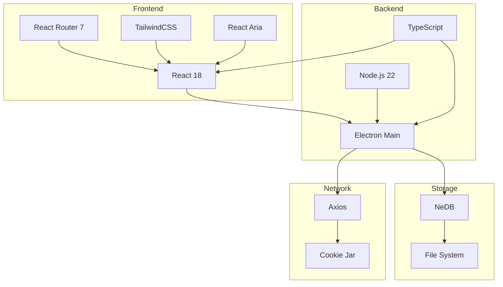

### 6.2 Arquitetura de Código

```
api-client-mvp/
├── src/
│   ├── main/                   # Electron Main Process
│   │   ├── index.ts           # Entry point
│   │   ├── window.ts          # Window management
│   │   ├── database/          # Database layer
│   │   │   ├── index.ts
│   │   │   ├── models. ts
│   │   │   └── migrations.ts
│   │   ├── http/              # HTTP client
│   │   │   ├── client.ts
│   │   │   ├── auth.ts
│   │   │   └── cookies.ts
│   │   ├── ipc/               # IPC handlers
│   │   │   ├── workspace.ts
│   │   │   ├── request.ts
│   │   │   ├── environment.ts
│   │   │   └── response.ts
│   │   └── utils/
│   │
│   ├── renderer/              # React App
│   │   ├── index.tsx         # Entry point
│   │   ├── App.tsx           # Root component
│   │   ├── routes/           # React Router routes
│   │   │   ├── workspace.tsx
│   │   │   ├── request.tsx
│   │   │   └── settings.tsx
│   │   ├── components/       # UI Components
│   │   │   ├── layout/
│   │   │   ├── request/
│   │   │   ├── response/
│   │   │   └── common/
│   │   ├── hooks/            # Custom hooks
│   │   ├── contexts/         # React contexts
│   │   ├── services/         # API services
│   │   └── utils/
│   │
│   ├── shared/               # Shared code
│   │   ├── types.ts         # TypeScript types
│   │   ├── constants.ts     # Constants
│   │   └── utils.ts         # Shared utils
│   │
│   └── preload/             # Electron Preload
│       └── index.ts         # IPC bridge
│
├── public/                  # Static assets
├── tests/                   # Tests
│   ├── unit/
│   ├── integration/
│   └── e2e/
├── package.json
├── tsconfig. json
├── vite.config.ts
└── electron-builder.json
```

### 6.3 Dependências Principais

```json
{
  "dependencies": {
    "electron": "^38.0.0",
    "react": "^18.3.1",
    "react-dom": "^18.3.1",
    "react-router":  "^7.0.0",
    "tailwindcss": "^4.0.0",
    "react-aria-components": "^1.0.0",
    "@seald-io/nedb": "^4.1.1",
    "axios": "^1.6.0",
    "uuid": "^9.0.1",
    "date-fns": "^3.6.0",
    "monaco-editor": "^0.52.0",
    "nunjucks": "^3.2.4",
    "tough-cookie": "^4.1.4"
  },
  "devDependencies": {
    "@types/react": "^18.3.0",
    "@types/node": "^22.0.0",
    "typescript": "^5.8.0",
    "vite": "^7.1.0",
    "electron-builder": "^26.0.0",
    "vitest": "^2.0.0",
    "playwright": "^1.50.0"
  }
}
```

---

## 7. Diagramas de Arquitetura

### 7.1 Arquitetura Geral do Sistema

```mermaid
graph TB
    subgraph "User Interface Layer"
        UI[React Components]
        Router[React Router]
        State[React Context/Hooks]
    end
    
    subgraph "Electron Renderer Process"
        UI --> Router
        Router --> State
        State --> IPC_R[IPC Renderer]
    end
    
    subgraph "Electron Main Process"
        IPC_M[IPC Main Handlers]
        DB[Database Manager]
        HTTP[HTTP Client]
        FileSystem[File System]
        
        IPC_M --> DB
        IPC_M --> HTTP
        IPC_M --> FileSystem
    end
    
    subgraph "Storage Layer"
        NeDB[(NeDB)]
        Files[Response Bodies]
        Config[Config Files]
        
        DB --> NeDB
        FileSystem --> Files
        FileSystem --> Config
    end
    
    subgraph "External"
        APIs[REST APIs]
        HTTP --> APIs
    end
    
    IPC_R -.IPC Bridge. -> IPC_M
    
    style UI fill:#e1f5ff
    style IPC_M fill:#fff4e1
    style NeDB fill:#f0f0f0
```

### 7.2 Arquitetura de Comunicação IPC

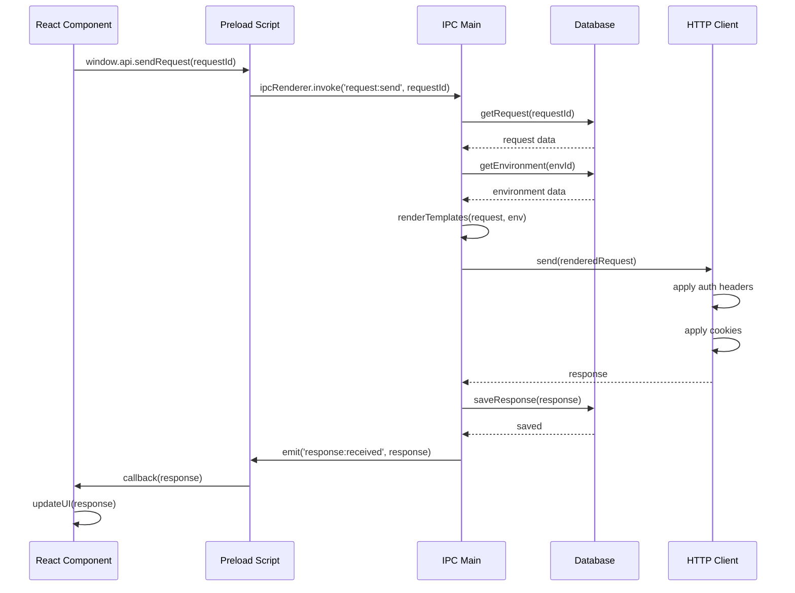

### 7.3 Fluxo de Dados

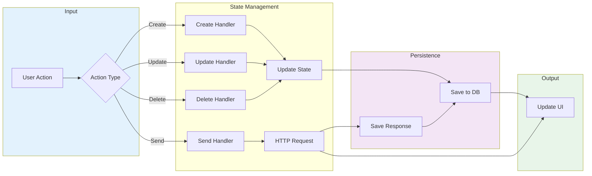

### 7.4 Arquitetura de Módulos

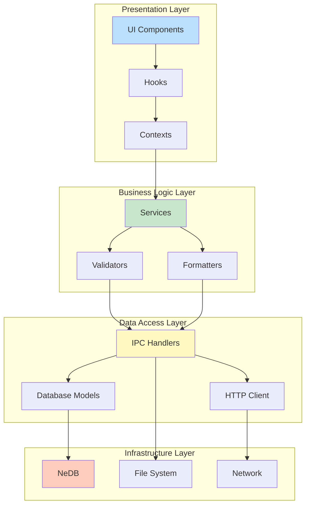

---

## 8. User Flows

### 8.1 Fluxo de Onboarding

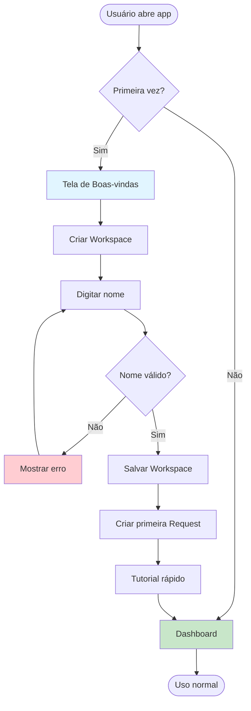

### 8.2 Fluxo de Enviar Request

```mermaid
flowchart TD
    Start([Usuário clica "Send"]) --> Validate{Validar Request}
    
    Validate -->|URL inválida| Error1[Erro:  URL inválida]
    Validate -->|Variável não encontrada| Error2[Erro:  Variável não existe]
    Validate -->|OK| Render[Renderizar templates]
    
    Error1 --> End1([Fim])
    Error2 --> End2([Fim])
    
    Render --> ApplyAuth[Aplicar autenticação]
    ApplyAuth --> ApplyCookies[Aplicar cookies]
    ApplyCookies --> Send[Enviar HTTP Request]
    
    Send --> Wait{Aguardar resposta}
    
    Wait -->|Timeout| Error3[Erro:  Timeout]
    Wait -->|Network Error| Error4[Erro:  Rede]
    Wait -->|Success| Process[Processar resposta]
    
    Error3 --> SaveError[Salvar erro]
    Error4 --> SaveError
    SaveError --> ShowError[Mostrar erro]
    ShowError --> End3([Fim])
    
    Process --> Parse[Parse body]
    Parse --> SaveResponse[Salvar response]
    SaveResponse --> UpdateUI[Atualizar UI]
    UpdateUI --> ShowResponse[Mostrar response]
    ShowResponse --> End4([Fim])
    
    style Send fill:#fff9c4
    style ShowResponse fill:#c8e6c9
    style Error1 fill:#ffcdd2
    style Error2 fill:#ffcdd2
    style Error3 fill:#ffcdd2
    style Error4 fill:#ffcdd2
```

### 8.3 Fluxo de Gerenciar Environments

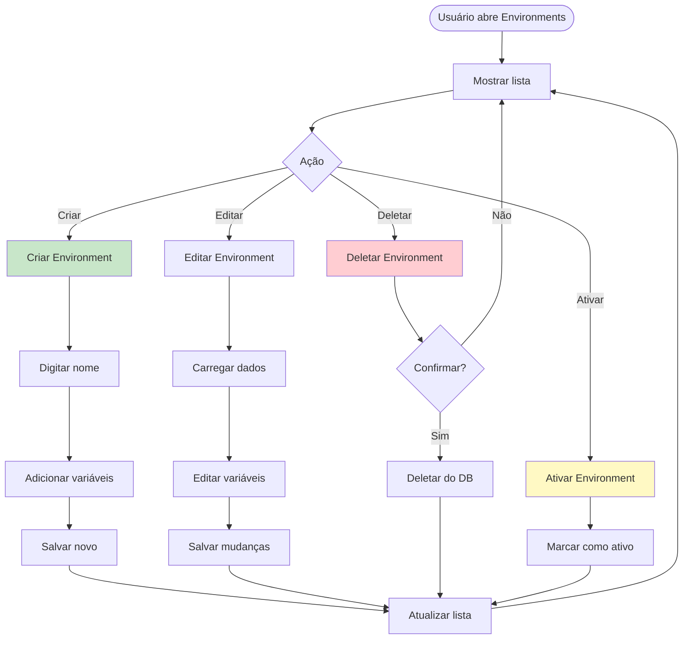

### 8.4 Fluxo de Organização

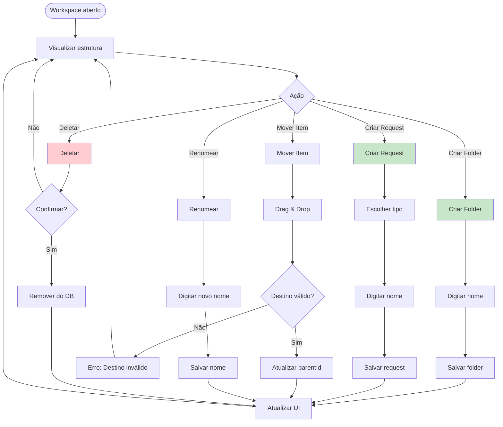

---

## 9. Modelo de Dados

### 9.1 Diagrama ER

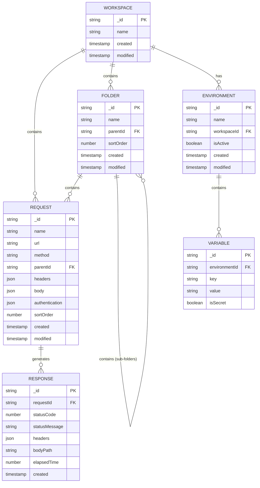

### 9.2 Schema de Collections (NeDB)

```typescript
// Workspace
interface Workspace {
  _id: string;              // "wrk_abc123"
  type: 'Workspace';
  name: string;             // "My Project"
  created: number;          // timestamp
  modified: number;         // timestamp
}

// Folder
interface Folder {
  _id: string;              // "fld_abc123"
  type:  'Folder';
  name: string;             // "Auth Endpoints"
  parentId: string;         // workspace or folder ID
  sortOrder: number;        // for ordering in sidebar
  created: number;
  modified: number;
}

// Request
interface Request {
  _id: string;              // "req_abc123"
  type: 'Request';
  name: string;             // "Get Users"
  url: string;              // "{{ base_url }}/users"
  method: string;           // "GET" | "POST" | "PUT" | "DELETE" | "PATCH"
  parentId: string;         // folder or workspace ID
  sortOrder: number;
  
  // Headers
  headers: Array<{
    name: string;
    value: string;
    enabled: boolean;
  }>;
  
  // Body
  body: {
    mimeType: string;       // "application/json" | "application/x-www-form-urlencoded" | "text/plain"
    text?:  string;          // raw text
    params?: Array<{        // for form-urlencoded
      name: string;
      value: string;
      enabled: boolean;
    }>;
  };
  
  // Authentication
  authentication:  {
    type: 'none' | 'basic' | 'bearer';
    username?: string;      // for basic
    password?: string;      // for basic
    token?: string;         // for bearer
  };
  
  created: number;
  modified: number;
}

// Response
interface Response {
  _id: string;              // "res_abc123"
  type: 'Response';
  requestId: string;        // parent request
  
  statusCode: number;       // 200, 404, 500, etc.
  statusMessage: string;    // "OK", "Not Found", etc.
  
  headers: Array<{
    name: string;
    value:  string;
  }>;
  
  bodyPath: string;         // path to file with response body
  elapsedTime: number;      // milliseconds
  
  created: number;          // timestamp
}

// Environment
interface Environment {
  _id: string;              // "env_abc123"
  type: 'Environment';
  name: string;             // "Development"
  workspaceId:  string;      // parent workspace
  isActive: boolean;        // only one can be active
  created: number;
  modified: number;
}

// Variable
interface Variable {
  _id: string;              // "var_abc123"
  type: 'Variable';
  environmentId: string;    // parent environment
  key: string;              // "base_url"
  value: string;            // "http://localhost:3000"
  isSecret:  boolean;        // for sensitive data
  created: number;
  modified: number;
}

// Settings (singleton)
interface Settings {
  _id: 'settings';
  type: 'Settings';
  
  // HTTP Settings
  timeout: number;          // request timeout in ms
  followRedirects: boolean;
  validateSSL: boolean;
  maxRedirects: number;
  
  // UI Settings
  theme: 'light' | 'dark' | 'auto';
  fontSize: number;
  
  // Storage
  maxHistoryResponses: number;  // keep last N responses
  
  modified: number;
}
```

### 9.3 Índices de Database

```typescript
// Índices para otimizar queries
db.ensureIndex({ fieldName: 'type' });
db.ensureIndex({ fieldName: 'parentId' });
db.ensureIndex({ fieldName: 'workspaceId' });
db.ensureIndex({ fieldName: 'requestId' });
db.ensureIndex({ fieldName: 'created' });
db.ensureIndex({ fieldName: 'sortOrder' });
```

---

## 10. Roadmap e Milestones

### 10.1 Timeline Geral

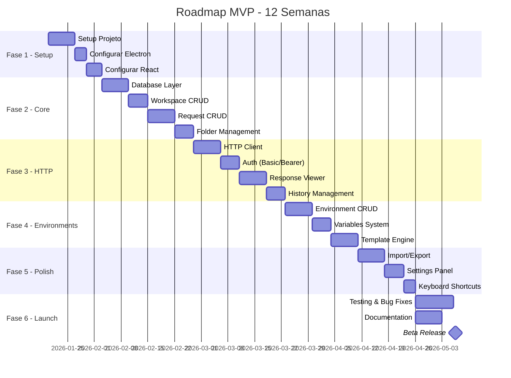

### 10.2 Milestones Detalhados

#### Milestone 1: Foundation (Semana 1-2)
**Data:** 03/02/2026  
**Objetivo:** Setup completo do projeto

**Deliverables:**
- ✅ Projeto Electron configurado
- ✅ React + React Router funcionando
- ✅ TailwindCSS integrado
- ✅ NeDB configurado
- ✅ Build pipeline (dev + prod)
- ✅ Testes básicos funcionando

**Critérios de Aceitação:**
- App abre sem erros
- Hot reload funciona
- Build gera executáveis
- Testes unitários passam

---

#### Milestone 2: Basic Functionality (Semana 3-4)
**Data:** 17/02/2026  
**Objetivo:** CRUD de Workspaces e Requests

**Deliverables:**
- ✅ Criar/Editar/Deletar Workspaces
- ✅ Criar/Editar/Deletar Requests
- ✅ Criar/Editar/Deletar Folders
- ✅ Sidebar com estrutura de árvore
- ✅ Persistência em NeDB

**Critérios de Aceitação:**
- Posso criar workspace e adicionar requests
- Posso organizar em folders
- Dados persistem após fechar app
- Interface navegável

---

#### Milestone 3: HTTP Client (Semana 5-7)
**Data:** 10/03/2026  
**Objetivo:** Envio de requisições HTTP funcionando

**Deliverables:**
- ✅ Request editor (URL, método, headers, body)
- ✅ HTTP client com Axios
- ✅ Suporte a todos métodos HTTP
- ✅ Autenticação Basic e Bearer
- ✅ Response viewer (status, headers, body)
- ✅ Formatação de JSON/XML
- ✅ Histórico de responses

**Critérios de Aceitação:**
- Posso enviar GET/POST/PUT/DELETE
- Vejo resposta formatada
- Headers são enviados corretamente
- Auth funciona
- Histórico salva últimas 10 responses

---

#### Milestone 4: Environments (Semana 8-9)
**Data:** 24/03/2026  
**Objetivo:** Sistema de variáveis de ambiente

**Deliverables:**
- ✅ CRUD de Environments
- ✅ CRUD de Variables
- ✅ Template engine ({{ variable }})
- ✅ Preview de request renderizada
- ✅ Troca rápida de environment
- ✅ Suporte a variáveis secretas

**Critérios de Aceitação:**
- Posso criar múltiplos environments
- Variáveis são substituídas corretamente
- Posso trocar environment facilmente
- Preview mostra valores finais

---

#### Milestone 5: Polish & Features (Semana 10-11)
**Data:** 07/04/2026  
**Objetivo:** Features complementares

**Deliverables:**
- ✅ Import/Export JSON
- ✅ Settings panel
- ✅ Keyboard shortcuts
- ✅ Search/Filter
- ✅ Dark mode
- ✅ Error handling melhorado

**Critérios de Aceitação:**
- Posso exportar e importar workspaces
- Atalhos de teclado funcionam
- Busca retorna resultados rápido
- Dark mode aplica corretamente
- Erros são tratados gracefully

---

#### Milestone 6: Launch (Semana 12)
**Data:** 14/04/2026  
**Objetivo:** Beta release pública

**Deliverables:**
- ✅ Testes E2E completos
- ✅ Documentação (README, CONTRIBUTING)
- ✅ Builds para todas plataformas
- ✅ GitHub release
- ✅ Landing page simples

**Critérios de Aceitação:**
- 90% de cobertura de testes
- Sem bugs críticos
- Documentação completa
- Executáveis funcionando em Win/Mac/Linux
- GitHub repository público

---

## 11. Critérios de Sucesso

### 11.1 Métricas de Produto

| Métrica | Baseline | Target (3 meses) | Método de Medição |
|---------|----------|------------------|-------------------|
| Downloads | 0 | 1,000+ | GitHub releases |
| MAU | 0 | 500+ | Telemetria (opt-in) |
| GitHub Stars | 0 | 100+ | GitHub API |
| NPS Score | - | 50+ | In-app survey |
| Crash Rate | - | < 0.1% | Sentry/error tracking |
| Avg Session Time | - | 15+ min | Telemetria |

### 11.2 Métricas de Desenvolvimento

| Métrica | Target | Método de Medição |
|---------|--------|-------------------|
| Code Coverage | > 60% | Jest/Vitest |
| Build Time | < 2 min | CI/CD pipeline |
| Bundle Size | < 100 MB | Electron builder |
| Startup Time | < 3s | Performance API |
| Memory Usage | < 200 MB | Task Manager |

### 11.3 Critérios de Qualidade

**Funcionalidade:**
- ✅ Todas user stories P0 implementadas
- ✅ Bugs críticos:  0
- ✅ Bugs high:  < 3

**Usabilidade:**
- ✅ SUS Score > 80
- ✅ Onboarding < 5 minutos
- ✅ Task completion rate > 90%

**Performance:**
- ✅ UI responsiva (< 100ms)
- ✅ Startup time < 3s
- ✅ Request overhead < 50ms

**Segurança:**
- ✅ Sem vulnerabilidades críticas
- ✅ Dados criptografados
- ✅ HTTPS funcionando

---

## 12. Riscos e Mitigações

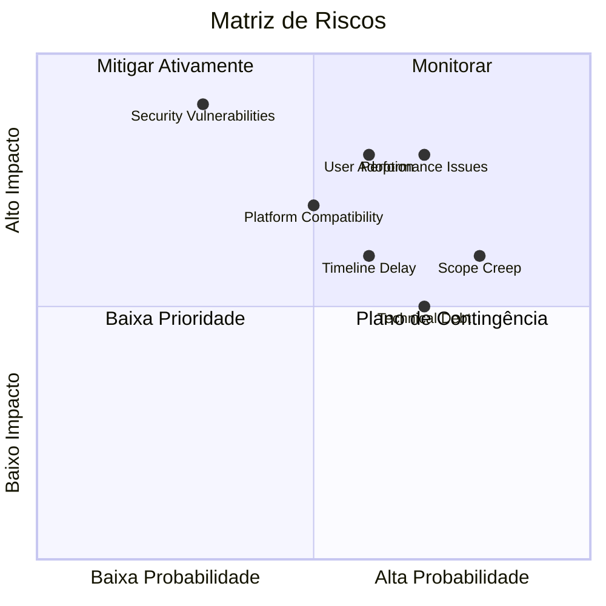

### 12.1 Riscos Técnicos

| Risco | Probabilidade | Impacto | Mitigação |
|-------|---------------|---------|-----------|
| **Performance Issues** | Alta (70%) | Alto | - Usar profiler desde início<br>- Lazy loading<br>- Code splitting<br>- Performance budget |
| **Security Vulnerabilities** | Média (30%) | Crítico | - Dependências auditadas<br>- Penetration testing<br>- Code review de segurança<br>- HTTPS enforced |
| **Platform Compatibility** | Média (50%) | Alto | - Testar em todas plataformas<br>- CI/CD para cada OS<br>- Beta testers em cada plataforma |
| **Data Corruption** | Baixa (20%) | Crítico | - Backup automático<br>- Migrations versionadas<br>- Validação de schema<br>- Recovery tools |

### 12.2 Riscos de Produto

| Risco | Probabilidade | Impacto | Mitigação |
|-------|---------------|---------|-----------|
| **Scope Creep** | Alta (80%) | Médio | - PRD bem definido<br>- Priorização rigorosa<br>- "Out of scope" list<br>- Regular backlog grooming |
| **User Adoption** | Média (60%) | Alto | - Beta testers engajados<br>- Early feedback loop<br>- Marketing em comunidades<br>- Comparação com Postman |
| **Competition** | Baixa (30%) | Médio | - Diferenciação clara<br>- Open-source advantage<br>- Foco em simplicidade |

### 12.3 Riscos de Timeline

| Risco | Probabilidade | Impacto | Mitigação |
|-------|---------------|---------|-----------|
| **Timeline Delay** | Média (60%) | Médio | - Buffer de 20% no schedule<br>- Sprints curtos (1 semana)<br>- Regular status updates<br>- MVP scope ajustável |
| **Technical Debt** | Alta (70%) | Médio | - Code review obrigatório<br>- Refactoring sprints<br>- Documentation contínua<br>- Test coverage mínimo |
| **Team Availability** | Baixa (20%) | Alto | - Documentação detalhada<br>- Pair programming<br>- Knowledge sharing<br>- Handoff procedures |

### 12.4 Planos de Contingência

**Se performance for inaceitável:**
1. Profiling detalhado
2. Otimizar queries de DB
3. Implementar virtualização de listas
4. Considerar alternativa ao NeDB

**Se timeline atrasar > 2 semanas:**
1. Re-priorizar features
2. Mover features P2 para pós-MVP
3. Aumentar equipe (se possível)
4. Ajustar expectativas de stakeholders

**Se adoption for baixa:**
1. User interviews para entender blockers
2. Melhorar onboarding
3. Criar tutoriais em vídeo
4. Programa de early adopters

---

## 13. Glossário

| Termo | Definição |
|-------|-----------|
| **API Client** | Aplicação para testar e interagir com APIs |
| **Collection** | Conjunto de requests organizadas |
| **Environment** | Conjunto de variáveis para diferentes ambientes (dev, staging, prod) |
| **Folder** | Container para organizar requests |
| **IPC** | Inter-Process Communication - comunicação entre Main e Renderer no Electron |
| **Request** | Definição de uma chamada HTTP (método, URL, headers, body) |
| **Response** | Resultado retornado pela API após enviar um request |
| **Template Variable** | Variável que pode ser usada com sintaxe {{ variable }} |
| **Workspace** | Container principal que agrupa folders e requests |
| **Bearer Token** | Token de autenticação enviado no header Authorization |
| **Basic Auth** | Autenticação com username e password em Base64 |
| **NeDB** | Banco de dados NoSQL embedded, similar ao MongoDB |
| **Electron** | Framework para criar apps desktop com web technologies |
| **React Router** | Biblioteca de roteamento para React |
| **TailwindCSS** | Framework CSS utility-first |

---

## Apêndices

### A. Keyboard Shortcuts

| Ação | Atalho |
|------|--------|
| Send Request | `Ctrl/Cmd + Enter` |
| New Request | `Ctrl/Cmd + N` |
| New Folder | `Ctrl/Cmd + Shift + N` |
| Search | `Ctrl/Cmd + F` |
| Settings | `Ctrl/Cmd + ,` |
| Toggle Sidebar | `Ctrl/Cmd + \` |
| Next Tab | `Ctrl/Cmd + Tab` |
| Previous Tab | `Ctrl/Cmd + Shift + Tab` |
| Duplicate Request | `Ctrl/Cmd + D` |
| Delete | `Delete` |

### B. API Surface (IPC)

```typescript
// Workspace Operations
window.api.workspace.create(data:  WorkspaceData): Promise<Workspace>
window.api.workspace.update(id: string, data:  Partial<WorkspaceData>): Promise<Workspace>
window. api.workspace.delete(id: string): Promise<void>
window.api.workspace.getAll(): Promise<Workspace[]>
window.api.workspace.getById(id: string): Promise<Workspace>

// Request Operations
window.api. request.create(data: RequestData): Promise<Request>
window. api.request.update(id: string, data: Partial<RequestData>): Promise<Request>
window.api.request.delete(id: string): Promise<void>
window.api.request.duplicate(id: string): Promise<Request>
window.api.request. send(id: string): Promise<Response>
window.api.request. getByWorkspace(workspaceId: string): Promise<Request[]>

// Folder Operations
window.api.folder.create(data: FolderData): Promise<Folder>
window.api.folder. update(id: string, data:  Partial<FolderData>): Promise<Folder>
window.api.folder.delete(id: string): Promise<void>
window.api.folder.move(id: string, newParentId: string): Promise<Folder>

// Environment Operations
window.api. environment.create(data: EnvironmentData): Promise<Environment>
window.api.environment.update(id: string, data: Partial<EnvironmentData>): Promise<Environment>
window.api. environment.delete(id: string): Promise<void>
window.api.environment.activate(id: string): Promise<void>
window.api.environment. getByWorkspace(workspaceId:  string): Promise<Environment[]>

// Variable Operations
window.api.variable. create(data: VariableData): Promise<Variable>
window. api.variable.update(id: string, data: Partial<VariableData>): Promise<Variable>
window.api.variable. delete(id: string): Promise<void>
window.api.variable.getByEnvironment(environmentId: string): Promise<Variable[]>

// Response Operations
window.api.response. getHistory(requestId: string, limit?:  number): Promise<Response[]>
window.api.response.getById(id: string): Promise<Response>
window.api.response.deleteHistory(requestId: string): Promise<void>

// Import/Export Operations
window.api.export.workspace(workspaceId: string): Promise<string>
window.api.import.fromJSON(json: string): Promise<Workspace>
window.api.import.fromPostman(json: string): Promise<Workspace>

// Settings Operations
window.api.settings. get(): Promise<Settings>
window.api.settings.update(data: Partial<Settings>): Promise<Settings>

// Events
window.api.on('response: received', callback: (response: Response) => void)
window.api.on('request:sent', callback: (requestId: string) => void)
window.api.on('error', callback: (error: Error) => void)
```

### C. Testing Strategy

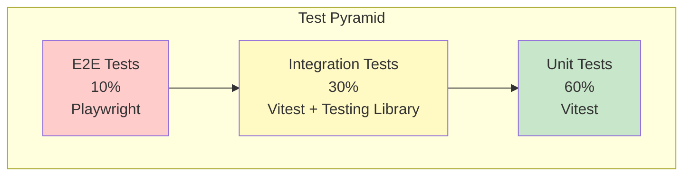

**Unit Tests (60%):**
- Services/Utils/Helpers
- Pure functions
- Data transformations
- Validators

**Integration Tests (30%):**
- IPC handlers
- Database operations
- HTTP client
- Component + hooks

**E2E Tests (10%):**
- Critical user flows
- Smoke tests
- Cross-platform compatibility

---

## Aprovações

| Papel | Nome | Assinatura | Data |
|-------|------|------------|------|
| Product Owner | [Nome] | __________ | ______ |
| Tech Lead | [Nome] | __________ | ______ |
| UX Designer | [Nome] | __________ | ______ |
| QA Lead | [Nome] | __________ | ______ |

---

## Change Log

| Versão | Data | Autor | Mudanças |
|--------|------|-------|----------|
| 1.0 | 2026-01-12 | [Nome] | Versão inicial do PRD |

---

**Fim do PRD**

Este documento define o escopo completo do MVP.  Quaisquer mudanças devem ser documentadas e aprovadas por todos stakeholders. 