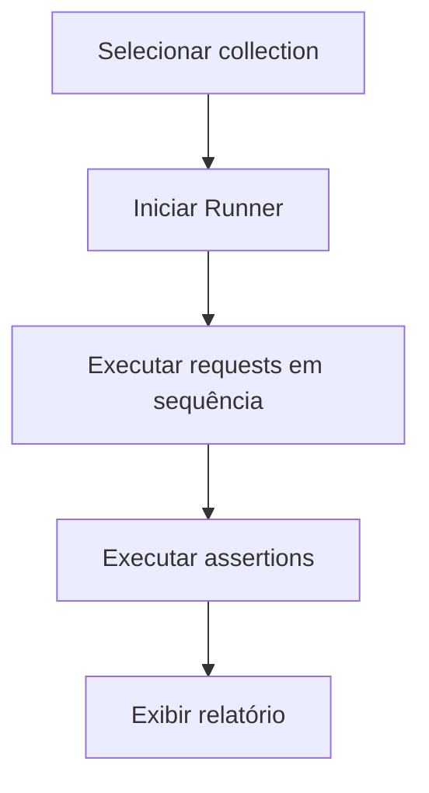
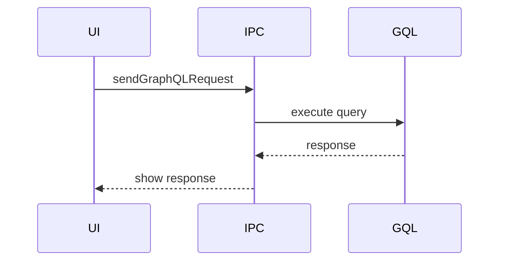

# 📋 PRD - Próximas Features (Pós-MVP)

**Product Requirements Document**  
**Version:** 2.0  
**Date:** Janeiro 2026  
**Status:** Draft  
**Product Name:** Requiety

---

## 📑 Índice

1. [Visão Geral](#1-visão-geral)
2. [Objetivos do Produto](#2-objetivos-do-produto)
3. [Escopo e Priorização](#3-escopo-e-priorização)
4. [Personas e User Stories](#4-personas-e-user-stories)
5. [Requisitos Funcionais](#5-requisitos-funcionais)
6. [Requisitos Não-Funcionais](#6-requisitos-não-funcionais)
7. [Especificações Técnicas](#7-especificações-técnicas)
8. [User Flows](#8-user-flows)
9. [Métricas de Sucesso](#9-métricas-de-sucesso)
10. [Roadmap e Milestones](#10-roadmap-e-milestones)
11. [Riscos e Mitigações](#11-riscos-e-mitigações)
12. [Glossário](#12-glossário)

---

## 1. Visão Geral

### 1.1 Problema

O MVP atende o uso básico de REST APIs, mas ainda falta suporte a fluxos avançados usados diariamente por times de desenvolvimento e QA, como:
- Testes automatizados por request
- Scripts para pré e pós-processamento
- Suporte a protocolos modernos (GraphQL, WebSocket, gRPC)
- Sincronização de projetos entre máquinas e times

### 1.2 Solução

Expandir o Requiety com um **conjunto de features avançadas e colaborativas**, mantendo o foco em desempenho, simplicidade e uso offline-first. Este PRD define a próxima etapa de produto para:
- Elevar produtividade com automação e testes
- Aumentar a compatibilidade com stacks modernas
- Melhorar colaboração e compartilhamento

---

## 2. Objetivos do Produto

### 2.1 Objetivos de Negócio

| Objetivo | Métrica | Target (6 meses) |
|----------|---------|------------------|
| Adoção | Downloads | 10.000+ |
| Engajamento | MAU | 2.500+ |
| Retenção | D30 | 35%+ |
| Comunidade | Issues/PRs | 100+ |

### 2.2 Objetivos de Usuário

1. **Automação:** Executar suites de testes com 1 clique
2. **Compatibilidade:** Testar REST, GraphQL e WebSocket no mesmo app
3. **Colaboração:** Sincronizar workspaces com o time
4. **Eficiência:** Reduzir tempo de setup de requests complexas em 40%

---

## 3. Escopo e Priorização

### 3.1 In Scope (Próxima Fase)

- ✅ Testes por request (assertions)
- ✅ Scripts pré/pós request
- ✅ GraphQL Client
- ✅ WebSocket Client
- ✅ gRPC básico
- ✅ OAuth 2.0 completo
- ✅ Git Sync (workspaces versionados)
- ✅ Cloud Sync (opcional)
- ✅ Mock Server simples

### 3.2 Out of Scope (Fase Posterior)

- ❌ Marketplace de plugins
- ❌ Editor visual de flows (API chaining)
- ❌ API Gateway embutido
- ❌ Monitoramento em produção

### 3.3 Priorização (RICE)

| Feature | Reach | Impact | Confidence | Effort | Score |
|---------|-------|--------|------------|--------|-------|
| Testes por request | 8 | 3 | 0.8 | 2 | 9.6 |
| Scripts pré/pós | 7 | 3 | 0.7 | 3 | 4.9 |
| GraphQL Client | 6 | 2 | 0.8 | 3 | 3.2 |
| OAuth 2.0 completo | 6 | 2 | 0.7 | 4 | 2.1 |
| WebSocket Client | 5 | 2 | 0.7 | 4 | 1.8 |
| Git Sync | 5 | 2 | 0.6 | 5 | 1.2 |
| Mock Server | 4 | 2 | 0.6 | 5 | 1.0 |
| gRPC básico | 3 | 2 | 0.6 | 5 | 0.7 |
| Cloud Sync | 3 | 2 | 0.5 | 6 | 0.5 |

---

## 4. Personas e User Stories

### 4.1 Novas Personas

#### Persona 3: Eduardo - Tech Lead
- **Idade:** 35 anos
- **Experiência:** 10 anos
- **Pain Points:** precisa de consistência entre requests do time
- **Goals:** versionar coleções, revisões via Git

#### Persona 4: Luana - Frontend Developer
- **Idade:** 26 anos
- **Experiência:** 3 anos
- **Pain Points:** testar GraphQL e WebSocket no mesmo app
- **Goals:** explorar schemas e subscriptions

### 4.2 User Stories Prioritárias

```
US-101: Como QA, quero criar testes para validar status code e body
PARA automatizar validações de regressão

Critérios de Aceitação:
- Posso adicionar múltiplas assertions
- Suporte a status, headers e JSONPath
- Resultado dos testes aparece no response viewer

Prioridade: P0
```

```
US-102: Como dev, quero rodar scripts antes e depois da request
PARA montar payloads dinâmicos e transformar responses

Critérios de Aceitação:
- Scripts em JavaScript (sandbox)
- Acesso a environment variables e response
- Logs visíveis no console de execução

Prioridade: P0
```

```
US-103: Como dev, quero enviar requests GraphQL
PARA testar queries e mutations com autocompletar

Critérios de Aceitação:
- Editor com syntax highlight
- Introspection automática
- Histórico de queries

Prioridade: P1
```

---

## 5. Requisitos Funcionais

### 5.1 Automação & Testes

#### RF-101: Assertions
- Sistema DEVE permitir criar assertions por request
- Sistema DEVE suportar validação de status, headers e body JSON
- Sistema DEVE exibir resultado de cada assertion (pass/fail)

#### RF-102: Test Runner
- Sistema DEVE permitir executar um conjunto de requests em sequência
- Sistema DEVE exibir relatório agregado
- Sistema DEVE permitir re-run de falhas

### 5.2 Scripts

#### RF-103: Pre-request Scripts
- Sistema DEVE executar scripts antes de enviar request
- Scripts DEVEM ter acesso a environment variables

#### RF-104: Post-request Scripts
- Sistema DEVE executar scripts após receber response
- Scripts DEVEM ter acesso a headers, body e status

### 5.3 Protocolos

#### RF-105: GraphQL
- Sistema DEVE suportar queries, mutations e subscriptions (WebSocket)
- Sistema DEVE salvar query e variáveis

#### RF-106: WebSocket
- Sistema DEVE conectar em endpoints WS
- Sistema DEVE enviar/receber mensagens em tempo real
- Sistema DEVE exibir histórico de mensagens

#### RF-107: gRPC
- Sistema DEVE permitir importar protos
- Sistema DEVE executar chamadas unary

### 5.4 Autenticação Avançada

#### RF-108: OAuth 2.0
- Sistema DEVE suportar OAuth 2.0 Authorization Code
- Sistema DEVE armazenar e renovar tokens

### 5.5 Colaboração

#### RF-109: Git Sync
- Sistema DEVE exportar/importar workspaces em formato Git-friendly
- Sistema DEVE permitir resolução básica de conflitos

#### RF-110: Cloud Sync
- Sistema DEVE sincronizar workspaces via backend opcional
- Usuário DEVE poder desativar sync

### 5.6 Mock Server

#### RF-111: Mocking
- Sistema DEVE permitir criar endpoints mock simples
- Sistema DEVE responder com payloads estáticos

---

## 6. Requisitos Não-Funcionais

### 6.1 Performance
- Editor GraphQL DEVE carregar schema em < 1s
- Runner de testes DEVE suportar 100 requests sem travar UI

### 6.2 Segurança
- Scripts DEVEM rodar em sandbox restrito
- Tokens OAuth DEVEM ser criptografados em disco

### 6.3 Usabilidade
- Runner e testes DEVEM ser acessíveis via keyboard shortcuts
- Mensagens de erro DEVEM ser amigáveis e acionáveis

---

## 7. Especificações Técnicas

### 7.1 Novos Módulos

```
src/
 ├── main/
 │   ├── grpc/
 │   ├── graphql/
 │   ├── websocket/
 │   ├── scripts/
 │   └── test-runner/
 ├── renderer/
 │   ├── components/graphql/
 │   ├── components/websocket/
 │   ├── components/tests/
 │   └── components/scripts/
 └── shared/
     └── test-types.ts
```

### 7.2 Dependências (Sugestão)

- `graphql` + `@graphiql/toolkit`
- `ws`
- `grpc-js` + `@grpc/proto-loader`
- `vm2` (sandbox scripts)
- `jsonpath-plus`

---

## 8. User Flows

### 8.1 Fluxo: Executar Suite de Testes



### 8.2 Fluxo: GraphQL Request



---

## 9. Métricas de Sucesso

| Métrica | Target (6 meses) |
|---------|------------------|
| Requests com testes configurados | 30% dos usuários ativos |
| Workspaces sincronizados | 20% dos usuários ativos |
| Uso de GraphQL | 25% dos usuários ativos |
| Crash rate | < 0.05% |

---

## 10. Roadmap e Milestones

### Milestone 7: Automação (Semana 1-3)
- Assertions por request
- Test runner básico
- Logs de execução

### Milestone 8: Protocolos (Semana 4-6)
- GraphQL client
- WebSocket client
- gRPC básico

### Milestone 9: Colaboração (Semana 7-9)
- Git Sync (export/import)
- Cloud Sync (opcional)

### Milestone 10: Mocking & Polimento (Semana 10-12)
- Mock server simples
- UX refinements
- Documentação completa

---

## 11. Riscos e Mitigações

| Risco | Probabilidade | Impacto | Mitigação |
|-------|---------------|---------|-----------|
| Scripts inseguros | Média | Alto | Sandbox estrito + allowlist APIs |
| Complexidade de protocolos | Alta | Médio | Implementar faseado e começar com MVPs | 
| Sync conflitado | Média | Médio | Estratégia de merge e backups locais |

---

## 12. Glossário

| Termo | Definição |
|-------|-----------|
| Assertion | Regra de validação de resposta | 
| Runner | Execução sequencial de requests | 
| GraphQL Introspection | Consulta para obter schema | 
| WebSocket | Protocolo de comunicação em tempo real |
| gRPC | Framework RPC baseado em Protobuf |

---

**Fim do PRD**
